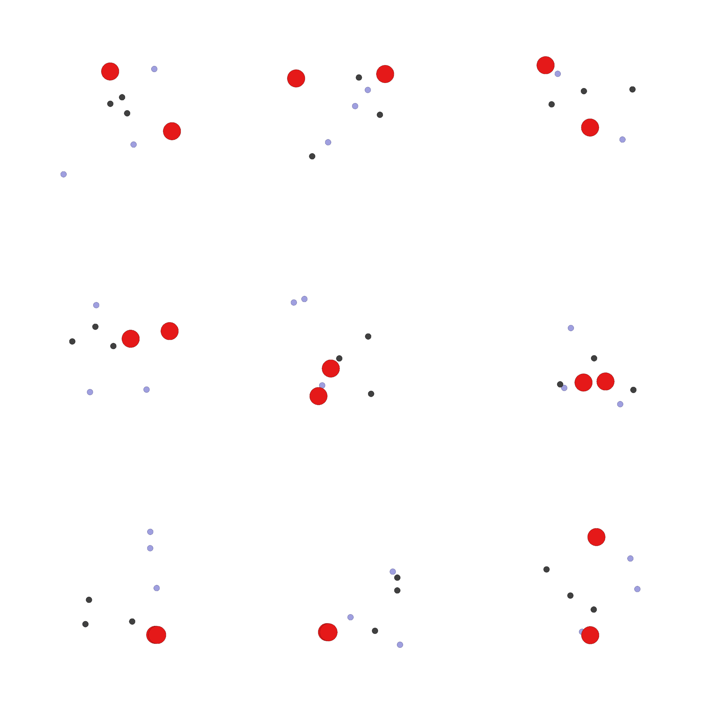

# COMP0124-MAAI-UAV-Collision-Avoidance

## MAPPO (based on [OpenRL](https://github.com/OpenRL-Lab/openrl))

The training and evaluation process of [MAPPO](https://arxiv.org/abs/2103.01955) are implemented in ```openrl``` folder.

To enable the OpenRL library
```
cd openrl
pip install .
```

Our custom MPE for MAPPO algorithm is defined in ```openrl/openrl/envs/mpe/scenarios/simple_spread.py```.

The trained MAPPO model is stored in ```openrl/examples/mpe/ppo_agent``` as .pt file.

To visualize the result of the trained MAPPO in our environment
```
cd openrl/examples/mpe/
python3 test_ppo.py
```

The gif file ```ppo.gif``` recorded the whole environment and actions of agents derived from trained MAPPO.
<div align="center">
  </a>
</div>
